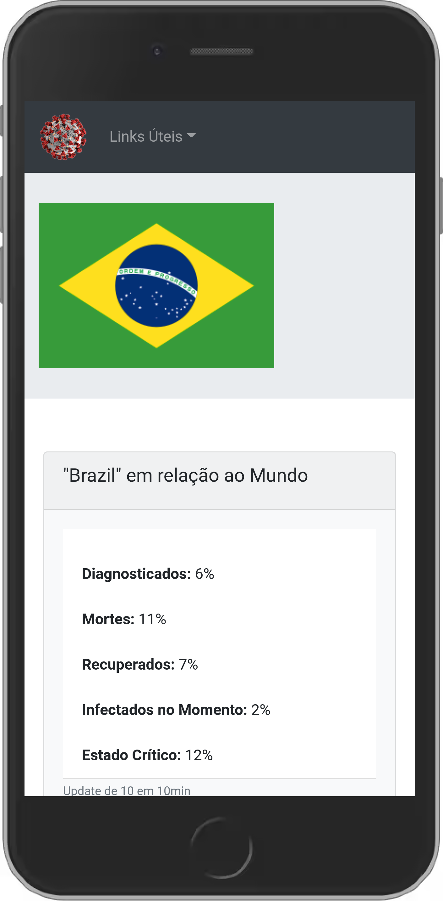

# Pandemia 

[PORTUGUÊS]: Aplicativo ReactJS que retorna estatísticas de pandemias (consultando a disease.sh)

## Endereço da APLICAÇÃO: 
https://pandemia.app.br

React App that consults api for world data about COVID-19
Coded by: Raul Castro. https://twitter.com/raulc27

## Informações sobre a API
### A <b>api</b> você pode obter informações em https://disease.sh, há um servidor Discord.